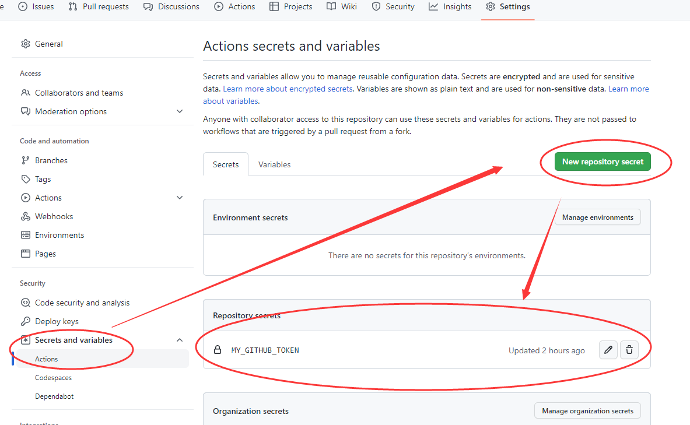

## 快速开始

## 命令

## 自动部署Action

> 使用github-action实现自动部署Github Pages

```yaml
# 自动部署hugo，到 gh-pages分支
name: github pages
# 触发条件和分支
on:
  push:
    branches:
      - main # Set a branch to deploy

jobs:
  deploy:
    runs-on: ubuntu-18.04
    steps:
      - uses: actions/checkout@v2
        with:
          submodules: true # Fetch Hugo themes (true OR recursive)
          fetch-depth: 0 # Fetch all history for .GitInfo and .Lastmod

      - name: Setup Hugo
        uses: peaceiris/actions-hugo@v2
        with:
          hugo-version: "latest" # 
          extended: true

      - name: Build
        run: hugo --minify

      - name: Deploy
        uses: peaceiris/actions-gh-pages@v3
        with:
          github_token: ${{ secrets.HUGO_THEME_TOKEN }}
          deploy_key: ${{ secrets.MY_ACTION_DEPLOY_KEY }}
          PUBLISH_BRANCH: gh-pages
          PUBLISH_DIR: ./public

```

### 注意事项

!!! danger "注意事项"
    设置 secrets，不是在设置页面的`Environments`而是在`Secrets and variables`的
    `Actions`中设置的！


